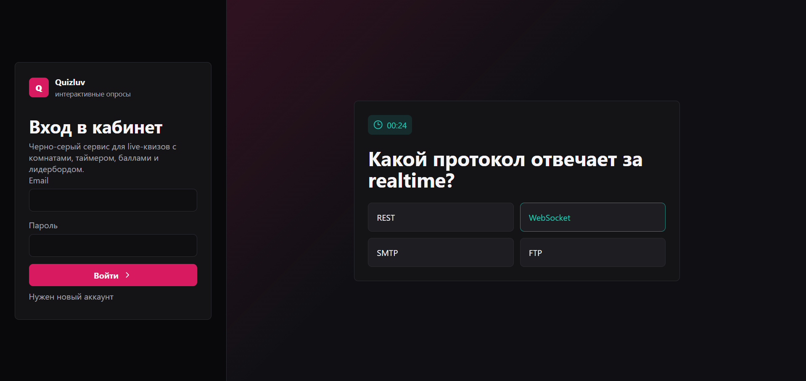
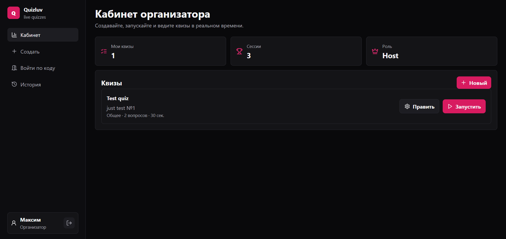
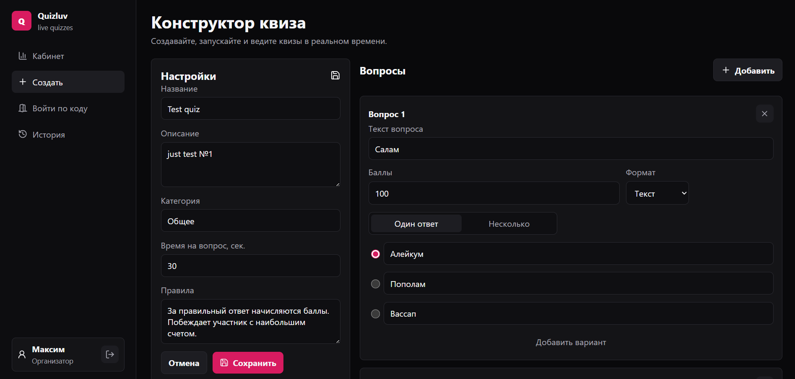
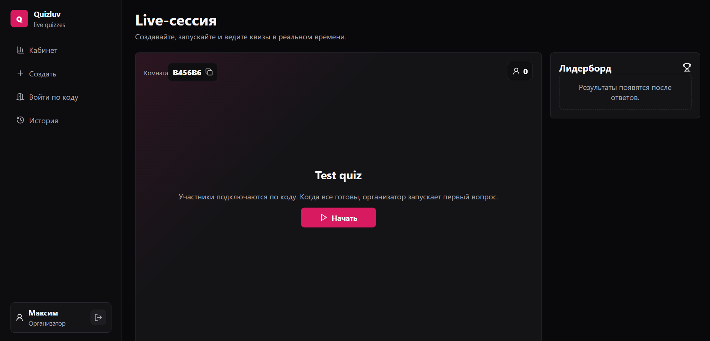
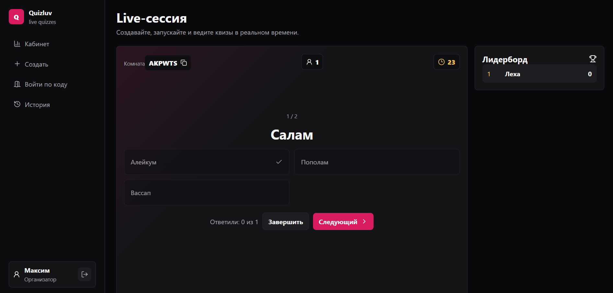
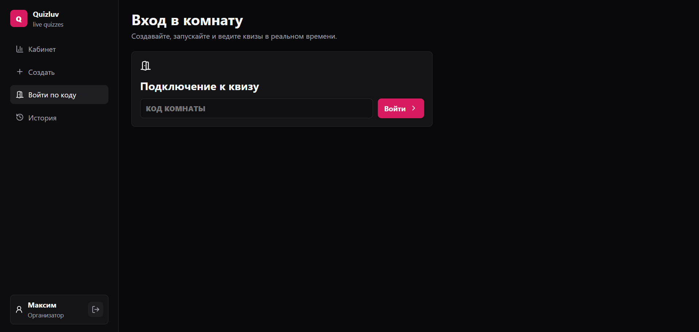
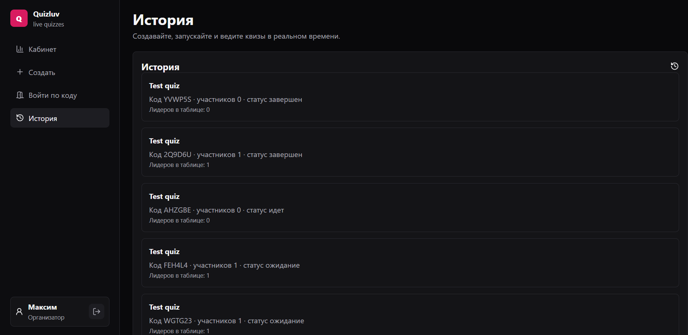

# Пояснительная записка к проекту Quizluv

## 1. Название проекта

**Quizluv** - веб-приложение для проведения интерактивных опросов и квизов в реальном времени.

Репозиторий проекта: https://github.com/freymi1856/quiz_vk

## 2. Цель проекта

Цель проекта - разработать работоспособный прототип веб-сервиса, который позволяет организаторам создавать квизы, запускать их в формате live-сессий и подключать участников по коду комнаты.

Участники отвечают на вопросы в реальном времени, после чего система подсчитывает баллы и формирует таблицу результатов. Приложение может использоваться для учебных опросов, мини-викторин, проверки знаний и интерактивных мероприятий.

## 3. Основные возможности приложения

В разработанном MVP реализованы следующие функции:

- регистрация и авторизация пользователей;
- разделение пользователей на организаторов и участников;
- личный кабинет организатора;
- создание и настройка квиза;
- добавление вопросов с вариантами ответов;
- поддержка одиночного и множественного выбора;
- настройка времени на вопрос, категории и правил проведения;
- запуск live-сессии;
- подключение участников по коду комнаты;
- синхронное отображение вопросов в реальном времени;
- отправка ответов участниками;
- подсчет баллов;
- отображение лидерборда;
- сохранение истории проведенных сессий.

## 4. Выбор технологий

Для реализации проекта был выбран стек **JavaScript / Node.js / React**, так как он позволяет разрабатывать клиентскую и серверную часть на одном языке и хорошо подходит для интерактивных веб-приложений.

Frontend реализован на **React** с использованием сборщика **Vite**. React выбран из-за удобной компонентной модели и возможности быстро обновлять интерфейс при изменении состояния приложения. Vite используется для быстрого запуска проекта в режиме разработки и сборки frontend-части.

Backend реализован на **Node.js** и **Express**. Express отвечает за REST API: регистрацию, авторизацию, работу с квизами, запуск сессий и получение истории.

Для взаимодействия в реальном времени используется **Socket.IO**. Эта библиотека позволяет организовать обмен данными между сервером, организатором и участниками без постоянной перезагрузки страницы. Через Socket.IO реализованы live-комнаты, переключение вопросов, отправка ответов и обновление лидерборда.

Для хранения данных в MVP используется JSON-файл `server/data/store.json`. Такое решение подходит для прототипа, так как не требует отдельной настройки базы данных. При развитии проекта JSON-хранилище можно заменить на SQLite или PostgreSQL.

## 5. Архитектура приложения

Проект состоит из двух основных частей:

- `client` - frontend-приложение на React;
- `server` - backend-приложение на Node.js и Express.

Frontend отвечает за отображение интерфейса: вход, кабинет, конструктор квиза, подключение к комнате, live-сессию и историю.

Backend отвечает за:

- хранение пользователей, квизов, сессий и ответов;
- проверку авторизации;
- создание и редактирование квизов;
- запуск live-сессий;
- обработку WebSocket-событий;
- подсчет результатов.

Основные сущности системы:

- **User** - пользователь приложения;
- **Quiz** - созданный организатором квиз;
- **Question** - вопрос внутри квиза;
- **Option** - вариант ответа;
- **Session** - запущенная live-комната;
- **Participant** - участник конкретной сессии;
- **Answer** - ответ участника на вопрос.

## 6. Пользовательский сценарий

Основной сценарий работы с приложением:

1. Пользователь регистрируется или входит в систему.
2. Организатор переходит в личный кабинет.
3. Организатор создает квиз, задает название, описание, категорию, время на вопрос и правила.
4. Организатор добавляет вопросы и варианты ответов.
5. После сохранения квиза организатор запускает live-сессию.
6. Система создает код комнаты.
7. Участник входит в приложение и подключается к сессии по коду комнаты.
8. Организатор запускает первый вопрос.
9. Участники отвечают на вопрос в отведенное время.
10. Система принимает ответы и начисляет баллы.
11. После завершения квиза отображается лидерборд.
12. Информация о проведенной сессии сохраняется в истории.

## 7. Интерфейс приложения

Интерфейс выполнен в черно-серо-малиновой цветовой схеме. Темная палитра выбрана для того, чтобы приложение выглядело современно и было удобно для демонстрации на экране во время проведения квиза. Малиновый цвет используется для основных действий: входа, сохранения, запуска и перехода к следующему вопросу.

### Рисунок 1 - экран входа

На экране входа пользователь может авторизоваться или перейти к созданию нового аккаунта. Справа показана демонстрационная карточка вопроса, которая сразу объясняет назначение сервиса.



### Рисунок 2 - кабинет организатора

В кабинете организатор видит количество созданных квизов, количество сессий, свою роль и список доступных квизов. Для каждого квиза доступны действия редактирования и запуска.



### Рисунок 3 - конструктор квиза

Конструктор позволяет настроить основные параметры квиза и добавить вопросы. Для каждого вопроса можно указать текст, количество баллов, формат, режим ответа и варианты ответа.



### Рисунок 4 - live-сессия и код комнаты

После запуска квиза создается live-сессия с уникальным кодом комнаты. Участники используют этот код для подключения к активному квизу. Организатор может начать квиз, когда участники готовы.



### Рисунок 5 - показ вопроса в реальном времени

Во время live-сессии всем участникам показывается текущий вопрос. Организатор видит таймер, количество участников, варианты ответа и может переключить вопрос или завершить квиз.



### Рисунок 6 - вход участника по коду

Участник подключается к активному квизу через отдельный экран входа в комнату. Для подключения нужно ввести код, который был создан при запуске live-сессии.



### Рисунок 7 - история сессий

В разделе истории отображаются проведенные сессии, коды комнат, количество участников и статус квиза. Это подтверждает сохранение данных после завершения сессии.



## 8. Реализованный результат

В результате работы был создан работоспособный прототип веб-приложения Quizluv. Приложение позволяет пройти полный сценарий проведения интерактивного квиза: от регистрации и создания вопросов до запуска комнаты, подключения участников и сохранения истории.

MVP соответствует основным требованиям задания:

- организатор может создать и настроить квиз;
- участник может подключиться к активному квизу по коду;
- вопросы отображаются в режиме реального времени;
- ответы принимаются во время показа вопроса;
- система считает баллы;
- результаты сохраняются и отображаются в истории.

## 9. Запуск проекта

Для запуска проекта требуется установленный Node.js.

Команды запуска:

```bash
npm install
npm run dev
```

После запуска frontend доступен по адресу:

```text
http://localhost:5173
```

Backend API доступен по адресу:

```text
http://localhost:4000
```

## 10. Возможные улучшения

В дальнейшем проект можно развить следующими функциями:

- заменить JSON-хранилище на полноценную базу данных PostgreSQL или SQLite;
- добавить загрузку изображений на сервер;
- добавить экспорт результатов в CSV или Excel;
- добавить страницу подробной статистики по каждому вопросу;
- добавить восстановление активной сессии после перезагрузки страницы;
- добавить публичную ссылку на прохождение квиза;
- улучшить мобильную версию интерфейса;
- разместить приложение на хостинге.

## 11. Вывод

Проект Quizluv демонстрирует разработку интерактивного веб-приложения с клиентской и серверной частью, авторизацией пользователей и взаимодействием в реальном времени через WebSocket.

В рамках MVP реализованы основные функции, необходимые для проведения live-квизов: создание вопросов, запуск комнаты, подключение участников, ответы в реальном времени, подсчет баллов и сохранение истории. Разработанный прототип можно использовать как основу для дальнейшего развития полноценного сервиса интерактивных опросов.
